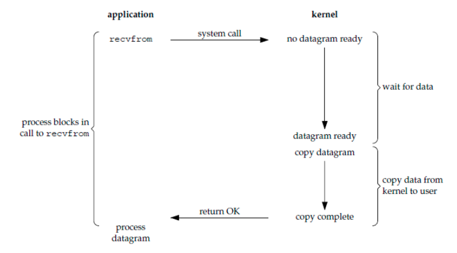
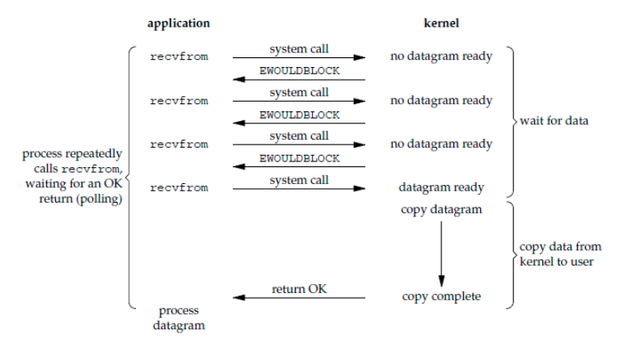
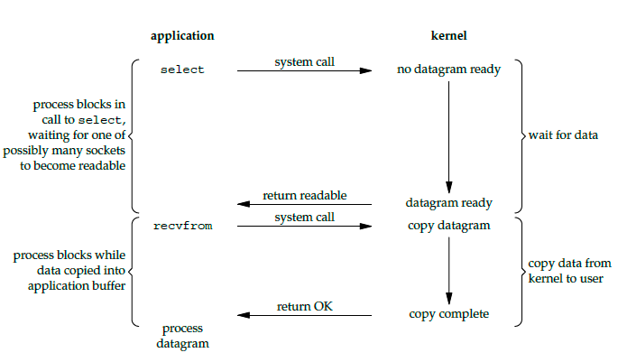
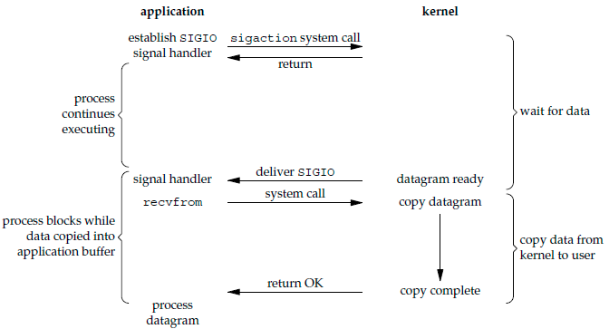
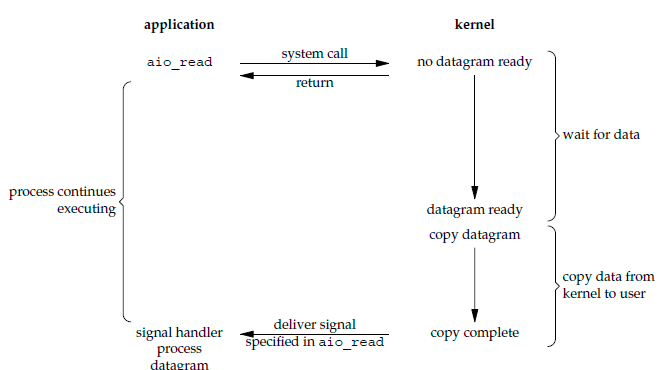
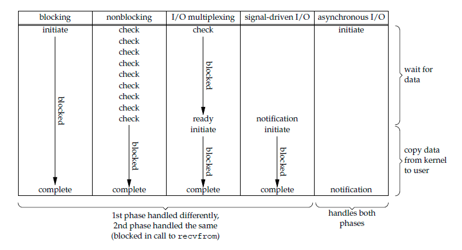
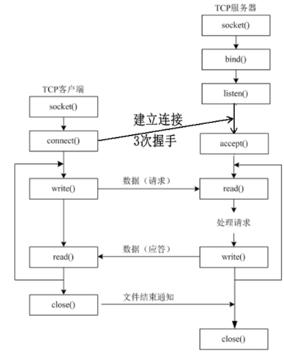

<!--more-->

# Unix IO模型简介

一个输入操作通常包括两个阶段：

* 等待数据准备好
* 从内核向进程复制数据

对于一个套接字上的输入输出，第一步通常涉及数据从网络中到达。当所等待的分组到达时，它被复制到内核中的某个缓冲区。第二部就是把数据从内核缓冲区中复制到进程缓冲区。

Unix下有5种IO模型：

* 同步阻塞IO
* 同步非阻塞IO
* IO复用
* 信号驱动式IO
* 异步IO

> recvfrom和sendto用于UDP和TCP
>
> recv和send用于TCP

同步异步针对于内核和进程之间的数据复制，阻塞非阻塞针对于网卡是否就绪。

# 同步阻塞IO

应用进程被阻塞，直到数据复制到应用进程缓冲区中才返回。

```c
ssize_t recvfrom(int sockfd, void *buf, size_t len, int flags, struct sockaddr *src_addr, socklen_t *addrlen);
```

cpu此时可以切换运行其他的程序。



发送数据的场景同理，sendto()阻塞直到发送完成。

# 同步非阻塞IO

若数据没准备好，io函数直接返回错误码或者一部分已读取到的数据，不会阻塞等待数据完全准备好。使用时一般通过轮询来获知数据是否准备完成。

cpu利用率较低。



# IO复用

相当于一次等待多个IO事件。可用select，poll或者epoll等函数。当某一个IO可读时返回。

IO复用中的非阻塞IO是指被等待的IO事件可以是非阻塞的。而select和poll等函数本身是阻塞的。



# 信号驱动IO

应用进程设置信号处理函数，然后继续执行，内核在数据到达后发送SIGIO信号，应用程序在收到信号后在信号处理函数中接收数据。

相比于非阻塞式 I/O 的轮询方式，信号驱动 I/O 的 CPU 利用率更高。



# 异步IO

应用进程执行aio_read 系统调用会立即返回，应用进程可以继续执行，不会被阻塞，内核会在所有操作完成之后向应用进程发送信号。

异步 I/O 与信号驱动 I/O 的区别在于，异步 I/O 的信号是通知应用进程 I/O 完成，而信号驱动 I/O 的信号是通知应用进程可以开始 I/O。



# 五大IO模型的比较

* 同步IO：将数据从内核缓冲区复制到应用进程缓冲区的阶段（第二阶段）不完成，进程无法执行接下来的操作。

- 异步 I/O：第二阶段未完成，应用进程可以执行接下来的操作。

同步 I/O 包括阻塞式 I/O、非阻塞式 I/O、I/O 复用和信号驱动 I/O ，它们的主要区别在第一个阶段。

非阻塞式 I/O 、信号驱动 I/O 和异步 I/O 在第一阶段不会阻塞。



# IO复用

## select

```c
int select(int n, fd_set *readfds, fd_set *writefds, fd_set *exceptfds, struct timeval *timeout);
```

select允许应用监视一组文件描述符，等待一个或多个描述符成为就绪状态，从而完成IO操作。

- fd_set 使用数组实现，数组大小使用 FD_SETSIZE 定义，所以只能监听少于 FD_SETSIZE 数量的描述符。readset、writeset、exceptset，分别代表自己感兴趣的读、写、异常事件对应的文件描述符集合。select返回后会修改它们来通知应用程序哪些文件描述符已经就位。
- timeout 为超时参数，调用 select 会一直阻塞直到有描述符的事件到达或者等待的时间超过 timeout。
- 成功调用返回结果大于 0，出错返回结果为 -1，超时返回结果为 0。

```c
fd_set fd_in, fd_out;
struct timeval tv;

// Reset the sets
FD_ZERO( &fd_in );
FD_ZERO( &fd_out );

// Monitor sock1 for input events
FD_SET( sock1, &fd_in );

// Monitor sock2 for output events
FD_SET( sock2, &fd_out );

// Find out which socket has the largest numeric value as select requires it
int largest_sock = sock1 > sock2 ? sock1 : sock2;

// Wait up to 10 seconds
tv.tv_sec = 10;
tv.tv_usec = 0;

// Call the select
int ret = select( largest_sock + 1, &fd_in, &fd_out, NULL, &tv );

// Check if select actually succeed
if ( ret == -1 )
    // report error and abort
else if ( ret == 0 )
    // timeout; no event detected
else
{
    if ( FD_ISSET( sock1, &fd_in ) )
        // input event on sock1

    if ( FD_ISSET( sock2, &fd_out ) )
        // output event on sock2
}
```

## poll

```c
int poll(struct pollfd *fds, unsigned int nfds, int timeout);
struct pollfd {
               int   fd;         /* file descriptor */
               short events;     /* 注册的事件 */
               short revents;    /* 实际发生的事件 */
           };
```

```c
struct pollfd fds[2];

// Monitor sock1 for input
fds[0].fd = sock1;
fds[0].events = POLLIN;

// Monitor sock2 for output
fds[1].fd = sock2;
fds[1].events = POLLOUT;

// Wait 10 seconds
int ret = poll( &fds, 2, 10000 );
// Check if poll actually succeed
if ( ret == -1 )
    // report error and abort
else if ( ret == 0 )
    // timeout; no event detected
else
{
    // If we detect the event, zero it out so we can reuse the structure
    if ( fds[0].revents & POLLIN )
        fds[0].revents = 0;
        // input event on sock1

    if ( fds[1].revents & POLLOUT )
        fds[1].revents = 0;
        // output event on sock2
}
```

通过pollfd中的events指定要监听fd上哪些事件，event是事件按位或；revents成员由内核修改，以通知应用程序fd上实际发生了哪些事件。

## 比较select和poll

### 功能

- select 会修改描述符集合，每次调用前都要重新设置，而 poll 不需要；
- select 的描述符类型使用数组实现，FD_SETSIZE 大小默认为 1024，因此默认只能监听少于 1024 个描述符。如果要监听更多描述符的话，需要修改 FD_SETSIZE 之后重新编译；而 poll 没有描述符数量的限制；
- poll 提供了更多的事件类型，并且对描述符的重复利用上比 select 高。
- 如果一个线程对某个描述符调用了 select 或者 poll，另一个线程关闭了该描述符，会导致调用结果不确定。

### 速度

select 和 poll 速度都比较慢，每次调用都需要将全部描述符从应用进程缓冲区复制到内核缓冲区，并且采用遍历的方式来检测就绪事件。

## epoll

```c
int epoll_create(int size);
```

函数返回事件表ID epfd。用于在内核上创建事件表。事件表用于存放用户感兴趣的文件描述符相关事件。已注册的描述符在内核中会被维护在一棵红黑树上，通过回调函数内核会将 I/O 准备好的描述符加入到一个链表中管理。

```c
int epoll_ctl(int epfd, int op, int fd, struct epoll_event *event)；
```

用于在事件表上注册，修改，删除事件。

```c
int epoll_wait(int epfd, struct epoll_event * events, int maxevents, int timeout);
```

等待事件就绪，并将就绪的事件复制到第二个参数中。

从上面的描述可以看出，epoll 只需要将描述符从进程缓冲区向内核缓冲区拷贝一次，并且进程不需要通过遍历来获得事件完成的描述符。

```c
int pollingfd = epoll_create( 0xCAFE );

if ( pollingfd < 0 )
 // report error

// Initialize the epoll structure in case more members are added in future
struct epoll_event ev = { 0 };

ev.data.ptr = pConnection1;
ev.events = EPOLLIN | EPOLLONESHOT;

if ( epoll_ctl( epollfd, EPOLL_CTL_ADD, pConnection1->getSocket(), &ev ) != 0 )
    // report error

// Wait for up to 20 events (assuming we have added maybe 200 sockets before that it may happen)
struct epoll_event pevents[ 20 ];

// Wait for 10 seconds, and retrieve less than 20 epoll_event and store them into epoll_event array
int ready = epoll_wait( pollingfd, pevents, 20, 10000 );
// Check if epoll actually succeed
if ( ret == -1 )
    // report error and abort
else if ( ret == 0 )
    // timeout; no event detected
else
{
    // Check if any events detected
    for ( int i = 0; i < ready; i++ )
    {
        if ( pevents[i].events & EPOLLIN )
        {
            // Get back our connection pointer
            Connection * c = (Connection*) pevents[i].data.ptr;
            c->handleReadEvent();
         }
    }
}
```

### 工作模式

epoll 的描述符事件有两种触发模式：LT（level trigger）和 ET（edge trigger）。

#### LT 模式

当 epoll_wait() 检测到描述符事件到达时，将此事件通知进程，进程可以不立即处理该事件，下次调用 epoll_wait() 会再次通知进程。是默认的一种模式，并且同时支持 Blocking 和 No-Blocking。

#### ET模式

和 LT 模式不同的是，通知之后进程必须立即处理事件，下次再调用 epoll_wait() 时不会再得到事件到达的通知。

很大程度上减少了 epoll 事件被重复触发的次数，因此效率要比 LT 模式高。只支持 No-Blocking。因为每个事件只被通知一次，因此要通过while(1)循环把事件相关数据读干净后break。若采用阻塞IO，会导致读或写操作没有后续事件而一直处于阻塞状态。

## 应用场景

很容易产生一种错觉认为只要用 epoll 就可以了，select 和 poll 都已经过时了，其实它们都有各自的使用场景。

### 1. select 应用场景

select 的 timeout 参数精度为微秒，而 poll 和 epoll 为毫秒，因此 select 更加适用于实时性要求比较高的场景，比如核反应堆的控制。

select 可移植性更好，几乎被所有主流平台所支持。

### 2. poll 应用场景

poll 没有最大描述符数量的限制，如果平台支持并且对实时性要求不高，应该使用 poll 而不是 select。

### 3. epoll 应用场景

只需要运行在 Linux 平台上，有大量的描述符需要同时轮询，并且这些连接最好是**长连接**。

需要同时监控小于 1000 个描述符，就没有必要使用 epoll，因为这个应用场景下并不能体现 epoll 的优势。

需要监控的描述符状态变化多，也没有必要使用 epoll。因为 epoll 中的所有描述符都存储在内核中，造成每次需要对描述符的状态改变都需要通过 epoll_ctl() 进行系统调用，频繁系统调用降低效率。并且 epoll 的描述符存储在内核，不容易调试。

### 4一般都使用非阻塞IO

读场景：

* 使用阻塞IO时，每次多路复用返回后只能调用一个read或者accept，防止阻塞住。**多路复用只会告诉你 fd 对应的 socket 可读了，但不会告诉你有多少的数据可读**。所以在需要多次读取的场景下，只能通过IO复用再次返回，效率低下。

* select 返回可读，和 read 去读，这是两个独立的系统调用，两个操作之间是有窗口的，也就是说 select 返回可读，紧接着去 read，不能保证一定可读。例如其他进程监听同一个描述符把数据读走了【惊群效应】，或者内核校验后将数据丢弃了。因此可能会被阻塞住。

  > 惊群效应：指多个进程同时阻塞（休眠，不耗费cpu）等待事件，如果等待的事件发生，那么会唤醒所有等待进程，但只有一个进程能获得事件，其他进程只能再次休眠。惊群效应会导致大量上下文切换，增加了开销。

写场景：

* 如果某个socket描述符返回可以写，说明描述符的发送缓冲区可用字节数高于低水位。那假设发送缓冲区低水位为100，目前发送缓冲区有1000Bytes的可用空间，如果你需要发2000Bytes的数据，如果socket是非阻塞的，发送完1000Bytes到发送缓冲区之后会立刻返回，等下次缓冲区可写时继续写；如果socket是阻塞的，发送完了1000Bytes到发送缓冲区，线程就阻塞了。

# 事件处理模式

同步I/O模型通常用于实现Reactor模式，异步I/O模型用于实现Proactor模式。

## Reactor

要求主线程只负责监听文件描述符上是否有事件发生，有的话就立即通知工作线程，除此之外主线程不做其他实质性工作。读写数据，接受新连接以及处理客户端请求都在工作线程完成。

## Proactor

将所有I/O操作都交给主线程和内核来处理。工作线程只负责业务逻辑。

# Unix中的IO流程



* bind：服务端将socket()创建的套接字fd与端口绑定，fd指定了相关协议。一个端口可以同时绑定TCP和UDP协议，根据IP协议首部字段确定该发送到哪个fd。客户端不需要bind()函数，因为发送时可以随机选用一个端口。
* listen：指定服务端的未完成连接队列和已完成连接队列长度。不阻塞。
* accept：服务端从已完成连接队列中取出一个连接，得到一个新的套接字。

## 服务端

```c
#include <stdio.h>
#include <stdlib.h>
#include <string.h>						
#include <unistd.h>
#include <sys/socket.h>
#include <netinet/in.h>
#include <arpa/inet.h>	
			
int main(int argc, char *argv[])
{
	unsigned short port = 8000;			
	
	int sockfd = socket(AF_INET, SOCK_STREAM, 0);   
	if(sockfd < 0)
	{
		perror("socket");
		exit(-1);
	}
	
	struct sockaddr_in my_addr;
	bzero(&my_addr, sizeof(my_addr));	     
	my_addr.sin_family = AF_INET;
	my_addr.sin_port   = htons(port);
	my_addr.sin_addr.s_addr = htonl(INADDR_ANY);
	
	int err_log = bind(sockfd, (struct sockaddr*)&my_addr, sizeof(my_addr));
	if( err_log != 0)
	{
		perror("binding");
		close(sockfd);		
		exit(-1);
	}
	
	err_log = listen(sockfd, 2);	// 等待队列为2
	if(err_log != 0)
	{
		perror("listen");
		close(sockfd);		
		exit(-1);
	}	
	printf("after listen\n");
	
	sleep(20);	//延时 20秒
	
	printf("listen client @port=%d...\n",port);
 
	int i = 0;
	
	while(1)
	{	
	
		struct sockaddr_in client_addr;		   
		char cli_ip[INET_ADDRSTRLEN] = "";	   
		socklen_t cliaddr_len = sizeof(client_addr);    
		
		int connfd;
		connfd = accept(sockfd, (struct sockaddr*)&client_addr, &cliaddr_len);       
		if(connfd < 0)
		{
			perror("accept");
			continue;
		}
 
		inet_ntop(AF_INET, &client_addr.sin_addr, cli_ip, INET_ADDRSTRLEN);
		printf("-----------%d------\n", ++i);
		printf("client ip=%s,port=%d\n", cli_ip,ntohs(client_addr.sin_port));
		
		char recv_buf[512] = {0};
		while( recv(connfd, recv_buf, sizeof(recv_buf), 0) > 0 )
		{
			printf("recv data ==%s\n",recv_buf);
			break;
		}
		
		close(connfd);     //关闭已连接套接字
		//printf("client closed!\n");
	}
	close(sockfd);         //关闭监听套接字
	return 0;
}
```

## 客户端

```c
#include <stdio.h>
#include <unistd.h>
#include <string.h>
#include <stdlib.h>
#include <arpa/inet.h>
#include <sys/socket.h>
#include <netinet/in.h>
 
void test_connect()
{
	unsigned short port = 8000;        		// 服务器的端口号
	char *server_ip = "10.221.20.12";    	// 服务器ip地址
	
	int sockfd;
	sockfd = socket(AF_INET, SOCK_STREAM, 0);// 创建通信端点：套接字
	if(sockfd < 0)
	{
		perror("socket");
		exit(-1);
	}
	
	struct sockaddr_in server_addr;
	bzero(&server_addr,sizeof(server_addr)); // 初始化服务器地址
	server_addr.sin_family = AF_INET;
	server_addr.sin_port = htons(port);
	inet_pton(AF_INET, server_ip, &server_addr.sin_addr);
	
	int err_log = connect(sockfd, (struct sockaddr*)&server_addr, sizeof(server_addr));      // 主动连接服务器
	if(err_log != 0)
	{
		perror("connect");
		close(sockfd);
		exit(-1);
	}
	
	printf("err_log ========= %d\n", err_log);
	
	char send_buf[100]="this is for test";
	send(sockfd, send_buf, strlen(send_buf), 0);   // 向服务器发送信息
	
	system("netstat -an | grep 8000");  // 查看连接状态
	
	//close(sockfd);
}
 
int main(int argc, char *argv[])
{
	pid_t pid;
	pid = fork();
	
	if(0 == pid){
 
		test_connect();		// 1
		
		pid_t pid = fork();
		if(0 == pid){
			test_connect();	// 2
		
		}else if(pid > 0){
			test_connect();	// 3
		}
		
	}else if(pid > 0){
		
		test_connect();	// 4
		
		pid_t pid = fork();
		if(0 == pid){
			test_connect();	// 5
		
		}else if(pid > 0){
			test_connect();	// 6
		}
	
	}
 
	while(1);
	
	return 0;
}
```

